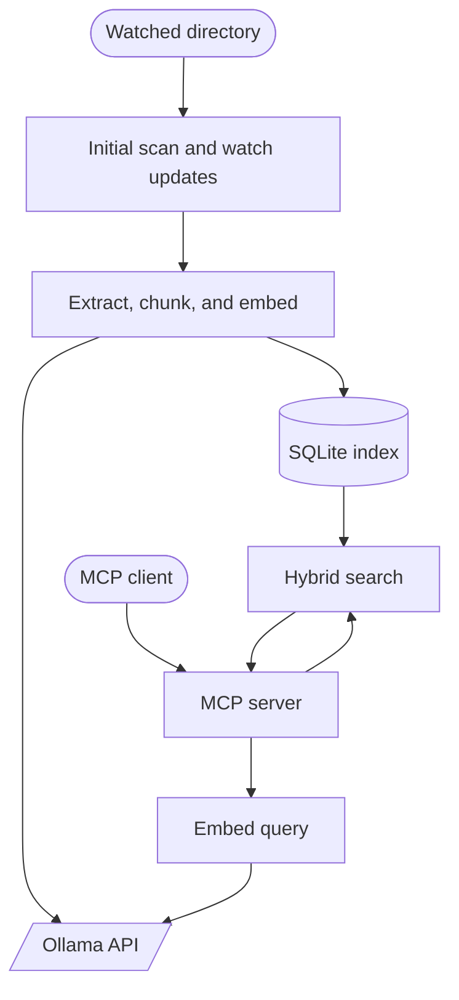

# quant

<p align="center">
  
</p>

A lightweight, developer-focused RAG index exposed as an MCP server. Point it at a folder and it watches the filesystem, extracts supported files, chunks them with structure awareness, embeds them via Ollama, stores them in SQLite, and serves semantic search over MCP.

The index is a projection of the filesystem. Files added, changed, or removed on disk are reflected in the index automatically.

In practice, `quant` is usually most useful as a project-scoped MCP - one server per repository, documentation set, or research workspace. See [docs/mcp-clients.md](docs/mcp-clients.md) for recommended deployment patterns and client configs.

Zero CGO. Pure Go.

## Runtime requirements

- A `quant` binary for your platform, either downloaded from GitHub Releases or built from source
- A coding agent or other MCP-capable client of your choice, such as Claude, Codex, OpenCode, or GitHub Copilot
- [Ollama](https://ollama.ai) running locally with an embedding model pulled:
  ```
  ollama pull nomic-embed-text
  ```
- Optional for scanned PDFs: [ocrmypdf](https://ocrmypdf.readthedocs.io/) installed on your system `PATH`. If present, `quant` will automatically use it as a best-effort OCR sidecar for PDFs that contain no extractable text.

## Build from source

You only need Go if you are building `quant` yourself instead of using a release binary.

- Go 1.26.1+

```
make build
```

Or directly:

```
mkdir -p bin && go build -o bin/quant ./cmd/quant
```

## Usage

```
./bin/quant mcp [--dir <path>] [options]
./bin/quant update
./bin/quant version
```

**Commands:**

| Command | Description |
|---------|-------------|
| `mcp` | Start the MCP server |
| `update` | Check for and apply the latest GitHub release |
| `version` | Print the quant version and exit |
| `help` | Show top-level CLI help |

**Core MCP flags:**

| Flag | Default | Description |
|------|---------|-------------|
| `--dir` | current working directory | Directory to watch and index |

For the full flag reference, environment variables, YAML config, include/exclude patterns, and auto-update settings see [docs/configuration.md](docs/configuration.md).

### Quick examples

```bash
# Index a folder over stdio
./bin/quant mcp --dir ./my-project

# Update to the latest release
./bin/quant update
```

## MCP Tools

| Tool | Description |
|---|---|
| `search` | Semantic search over indexed chunks. Params: `query` (required), `limit`, `threshold`, `path` |
| `list_sources` | List indexed documents. Params: `limit` |
| `index_status` | Stats: total docs, chunks, DB size, watch dir, model, lifecycle state |
| `find_similar` | Find chunks similar to a given chunk by its ID. Params: `chunk_id` (required), `limit` |

**`search`** embeds the query with the configured embedding model, uses SQLite FTS5 to prefilter candidate chunks, then reranks those candidates with normalized vector similarity. All results use Reciprocal Rank Fusion (RRF) scoring on a common 0-1 scale. If the embedding backend is unavailable, search falls back to keyword-only results automatically.

**`find_similar`** takes a chunk ID from a previous search result and returns the nearest neighbors from the HNSW index. It is useful for discovering related code or content across the index without needing to formulate a new query.

All MCP tools return structured payloads for clients that support `structuredContent`, while still including a readable text fallback. Tool concurrency is bounded by `--max-concurrent-tools` (default 4).

## Supported File Types

`quant` indexes common plain-text inputs by default, including source code, markup, config, data, and filename-only project files such as `Dockerfile`, `Makefile`, and similar repo metadata.

For document-style content, current support includes:

- Jupyter notebooks, with cell markers and captured text outputs
- PDF, with page markers like `[Page N]`
- Scanned PDF OCR via optional `ocrmypdf` fallback when a PDF has no embedded text
- Rich text via RTF
- Modern Office/Open XML word-processing, presentation, and spreadsheet files
- OpenDocument text, spreadsheet, and presentation files

See [docs/file-types.md](docs/file-types.md) for the full list of recognized extensions and special filenames.

Unsupported or binary files are skipped.

## Architecture



- **No CGO** - uses `modernc.org/sqlite` (pure Go SQLite)
- **Hybrid retrieval** - SQLite FTS5 prefilter + normalized vector rerank via RRF
- **Adaptive query weighting** - identifier-like queries (camelCase, short tokens) upweight keyword signals; longer natural-language queries upweight vector signals. Overridable via `--keyword-weight` / `--vector-weight`
- **HNSW approximate nearest neighbors** - in-memory HNSW graph (M=16, EfSearch=100) built from stored embeddings after initial sync; incremental add/delete during live indexing
- **Int8 quantized embeddings** - embeddings are L2-normalized and quantized to 1 byte/dimension (~4x storage savings, <1% recall loss)
- **Bounded-memory rerank** - top-k heap keeps vector reranking memory stable as candidate sets grow
- **Lifecycle-aware readiness** - startup indexing state (`starting` -> `indexing` -> `ready` / `degraded`) is surfaced through readiness checks and `index_status`
- **SQLite tuned for concurrency** - WAL + busy timeout + multi-connection pool allow reads during writes
- **Transactional indexing** - chunk replacement happens in a single SQLite transaction per document, with incremental HNSW updates deferred until after commit
- **Incremental reindexing** - unchanged chunks reuse their stored embeddings, so only new or modified content is sent to the embedding backend
- **File watching** via `fsnotify` with 500ms debounce and self-healing resync on overflow
- **Embedding caching** - LRU cache with in-flight deduplication and circuit breaker for query-time embedding calls

See [docs/architecture.md](docs/architecture.md) for the internal package layout.

## Further reading

- [Configuration reference](docs/configuration.md) - all flags, environment variables, YAML config, include/exclude patterns, auto-update
- [MCP client integration](docs/mcp-clients.md) - Claude Code, GitHub Copilot, Codex, OpenCode
- [Embedding models](docs/embedding.md) - model choice, quantization, and hardware guidance
- [Search and ranking](docs/search.md) - hybrid search pipeline, RRF fusion, and signal weighting
- [Supported file types](docs/file-types.md) - extensions, special filenames, and document extractors
- [Architecture](docs/architecture.md) - internal package layout and data flow

## Contributing

Fork, branch, add tests, submit a pull request.

## License

MIT - see [LICENSE](./LICENSE).
