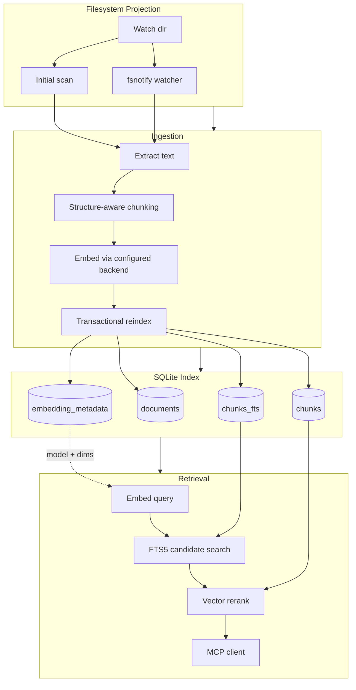

# quant

A lightweight, developer-focused RAG index exposed as an MCP server. Point it at a folder and it watches the filesystem, extracts supported files, chunks them with basic structure awareness, embeds them via Ollama, stores them in SQLite, and serves semantic search over MCP.

The index is a projection of the filesystem. Files added, changed, or removed on disk are reflected in the index. There is no separate feed mode, manual injection path, or index-only delete API.

Zero CGO. Pure Go.

## Requirements

- Go 1.26.1+
- [Ollama](https://ollama.ai) running locally with an embedding model pulled:
  ```
  ollama pull nomic-embed-text
  ```

## Build

```
make build
```

Or directly:
```
go build -o quant ./cmd/quant
```

## Usage

```
quant --dir <path> [options]
```

**Required:**
- `--dir` - Directory to watch and index

**Options:**
| Flag | Default | Description |
|------|---------|-------------|
| `--db` | `<dir>/.quant.db` | SQLite database path |
| `--transport` | `stdio` | MCP transport: `stdio`, `sse`, `http` |
| `--listen` | `:8080` | Listen address for SSE/HTTP |
| `--embed-url` | `http://localhost:11434` | Embedding API URL |
| `--embed-model` | `nomic-embed-text` | Embedding model |
| `--chunk-size` | `512` | Target chunk size in approximate words |
| `--chunk-overlap` | `0.15` | Chunk overlap fraction (0–1) |
| `--config` | - | YAML config file path |

All flags can also be set via env vars:
`QUANT_DIR`, `QUANT_DB`, `QUANT_TRANSPORT`, `QUANT_LISTEN`, `QUANT_EMBED_URL`, `QUANT_EMBED_MODEL`, `QUANT_CHUNK_SIZE`, `QUANT_CHUNK_OVERLAP`.

Configuration precedence is:
1. Defaults
2. YAML config file
3. Environment variables
4. Explicit CLI flags

### Examples

```bash
# Basic - index a folder over stdio
quant --dir ./my-project

# SSE transport for remote access
quant --dir ./my-project --transport sse --listen :9090

# Custom embedding endpoint via Ollama
quant --dir ./docs --embed-url http://gpu-server:11434 --embed-model mxbai-embed-large
```

### Config file

```yaml
dir: ./my-project
db: ./.quant.db
transport: stdio
listen: :8080
embed_url: http://localhost:11434
embed_model: nomic-embed-text
chunk_size: 512
chunk_overlap: 0.15
```

## Embedding Model Choice

Current code supports Ollama as the embedding backend, but the config names are generic so another backend can be added later without renaming the whole surface.

Practical defaults:

- `nomic-embed-text`: best default local balance of quality and footprint
- `all-minilm`: smaller and cheaper to run locally if you care more about CPU/RAM than retrieval quality
- `mxbai-embed-large`: higher-quality local option if you can afford a larger model

If you later add a hosted backend, the cheapest widely-used OpenAI embedding option is currently `text-embedding-3-small`.

## MCP Tools

| Tool | Description |
|------|-------------|
| `search` | Semantic search over indexed chunks. Params: `query` (required), `limit`, `threshold` |
| `list_sources` | List indexed documents |
| `index_status` | Stats: total docs, chunks, DB size, watch dir, model |

`search` embeds the query with the configured embedding model, uses SQLite FTS5 to prefilter candidate chunks, then reranks those candidates with normalized vector similarity.

### Claude Code config

Add to your Claude Code MCP settings:
```json
{
  "mcpServers": {
    "quant": {
      "command": "quant",
      "args": ["--dir", "/path/to/project"]
    }
  }
}
```

## Supported File Types

- **Code/text**: `.go`, `.py`, `.js`, `.ts`, `.rs`, `.java`, `.rb`, `.sh`, `.yaml`, `.json`, `.toml`, `.xml`, `.html`, `.css`, `.sql`, `.md`, `.txt`, and [more](internal/extract/text.go)
- **Common filename-only text files**: `Dockerfile`, `Makefile`, `Rakefile`, `Gemfile`
- **PDF**: `.pdf`, with page markers like `[Page N]`
- **Office**:
  - `.docx`, including main document text plus headers and footers when present
  - `.pptx`, with slide markers like `[Slide N]`
  - `.xlsx`, with sheet markers, cell references, shared strings, and formulas when present

Unsupported files are skipped.

## Indexing Behavior

- Initial startup scans the target directory and indexes supported files that are new or changed.
- A filesystem watcher keeps the index in sync after startup.
- Deleting a file from disk removes it from the index.
- The index stores embedding metadata in SQLite. If the configured embedding model or dimensions change, the existing index is cleared and rebuilt from the filesystem projection.
- Reindexing a document is transactional, so partial failures do not leave a document half-indexed.
- Only the root `.gitignore` is read for ignore rules. Nested `.gitignore` files in subdirectories are not supported.

## Architecture



- **No CGO** - uses `modernc.org/sqlite` (pure Go SQLite)
- **Hybrid retrieval** - SQLite FTS5 prefilter + normalized vector rerank
- **Embedding metadata** - stored in SQLite; index is rebuilt if model settings change
- **Transactional indexing** - chunk replacement happens in a single SQLite transaction per document
- **Office docs** parsed with stdlib `archive/zip` + `encoding/xml`, preserving more document structure
- **File watching** via `fsnotify` with 500ms debounce

## Test

```
make test
```
