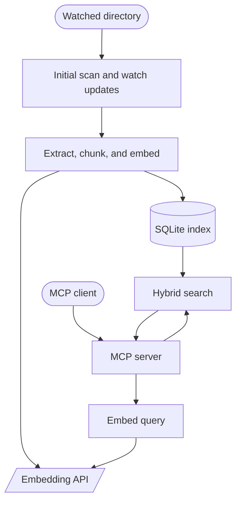

# quant

<p align="center">
  
</p>

A lightweight, developer-focused RAG index exposed as an MCP server. Point it at a folder and it watches the filesystem, extracts supported files, chunks them with structure awareness, embeds them through Ollama or an OpenAI-compatible API, stores them in SQLite, and serves semantic search over MCP.

The index is a projection of the filesystem. Files added, changed, or removed on disk are reflected in the index automatically.

In practice, `quant` is usually most useful as a project-scoped MCP - one server per repository, documentation set, or research workspace. See [docs/mcp-clients.md](docs/mcp-clients.md) for recommended deployment patterns and client configs.

Zero CGO. Pure Go.

## Runtime requirements

- A `quant` binary for your platform, either downloaded from GitHub Releases or built from source
- A coding agent or other MCP-capable client of your choice, such as Claude, Codex, OpenCode, or GitHub Copilot
- [Ollama](https://ollama.ai) installed locally, or an OpenAI-compatible embedding API at `--embed-url`

  `quant` handles Ollama setup automatically on first run:
  - If Ollama is installed but not running, `quant` starts it in the background (`ollama serve`)
  - If the configured embedding model isn't pulled yet, `quant` pulls it automatically (`ollama pull <model>`)
  - If local Ollama remains unavailable or its model cannot be pulled, `quant` starts in keyword-only mode so the MCP server remains usable. Other provider, authentication, URL, and protocol errors must be corrected before startup.

  To set up manually instead:
  ```
  ollama serve  # start Ollama
  ollama pull nomic-embed-text
  ```

- Optional for scanned PDFs: [ocrmypdf](https://ocrmypdf.readthedocs.io/) installed on your system `PATH`. If present, `quant` will automatically use it as a best-effort OCR sidecar for PDFs that contain no extractable text.

## Install

### macOS and Linux

The quickest install path on macOS and Linux is the release installer:

```bash
curl -fsSL https://raw.githubusercontent.com/koltyakov/quant/main/scripts/install.sh | sh
```

It installs `quant` to `~/.local/bin`. The installer checks whether `ollama` is on `PATH`; if it is missing, it asks whether to install Ollama with the official shell installer and prints manual setup guidance if skipped.

To uninstall the release binary:

```bash
curl -fsSL https://raw.githubusercontent.com/koltyakov/quant/main/scripts/uninstall.sh | sh
```

### Windows

On Windows, use the PowerShell installer:

```powershell
irm https://raw.githubusercontent.com/koltyakov/quant/main/scripts/install.ps1 | iex
```

It installs `quant.exe` to `%LOCALAPPDATA%\Programs\quant` and adds it to your user `PATH`. The installer also checks for Ollama and offers to install it via `winget`.

To uninstall the release binary and remove the install directory from your user `PATH`:

```powershell
irm https://raw.githubusercontent.com/koltyakov/quant/main/scripts/uninstall.ps1 | iex
```

### Alternative: build from a clone

The module uses a repository-local dependency shim, so `go install ...@latest` is not supported. If you already have Go installed, build from a clone instead:

```bash
git clone https://github.com/koltyakov/quant.git
cd quant
make install
```

After installing:

```bash
quant version
```

## Build from source

You only need Go if you are building `quant` yourself instead of using a release binary.

- Go 1.26.2+

```
make install
```

## Usage

```
quant mcp [--dir <path>] [options]
quant init [client] [options]
quant launch <client> [--dir <path>] [-- <client args...>]
quant update
quant version
```

**Commands:**

| Command | Description |
|---------|-------------|
| `mcp` | Start the MCP server |
| `init` | Scaffold a project MCP config and research assistant instructions |
| `launch` | Start a supported agent with quant MCP injected for this session |
| `update` | Check for and apply the latest GitHub release |
| `version` | Print the quant version and exit |
| `help` | Show top-level CLI help |

**Core MCP flags:**

| Flag | Default | Description |
|------|---------|-------------|
| `--dir` | current working directory | Directory to watch and index |

For the full flag reference, environment variables, YAML config, include/exclude patterns, and auto-update settings see [docs/configuration.md](docs/configuration.md).

### Quick examples

```bash
# Create a research workspace for Codex
quant init codex --dir ./my-research-project

# Launch Codex with quant MCP over ./data
quant launch codex

# Index a folder over stdio
quant mcp --dir ./my-project

# Update to the latest release
quant update
```

For clients with narrow MCP permission controls, `quant init` and `quant launch` also allow all `quant` MCP tools without prompting.

## MCP Tools

| Tool | Description |
|---|---|
| `search` | Semantic search over indexed chunks. Params: `query` (required, max 4,000 characters), `limit` (default 5, max 50), `threshold` (default 0), `path`, `file_type`, `language`, `collection` |
| `list_sources` | List indexed documents. Params: `limit` (default 100, max 500) |
| `index_status` | Stats: total docs, chunks, DB size, watch dir, model, embedding status, lifecycle state |
| `find_similar` | Find chunks similar to a given chunk by its ID. Params: `chunk_id` (required), `limit` (default 5, max 50) |
| `get_context` | Retrieve a chunk with ordered neighbors from the same document. Params: `chunk_id` (required), `before`, `after` (each default 1, max 5) |
| `drill_down` | Explore a topic by finding diverse chunks related to a seed chunk from a previous search. Params: `chunk_id` (required), `limit` (default 10, max 50) |
| `summarize_matches` | Return a non-exhaustive overview of top matching chunks and source documents. Params: `query` (required, max 4,000 characters), `limit` (default 20, max 50) |
| `list_collections` | List named collections in indexes populated with collection metadata |
| `delete_collection` | Delete all documents and chunks in a named collection. Params: `collection` (required) |

**`search`** retrieves keyword candidates through SQLite FTS5 and semantic candidates through HNSW (or a bounded exact fallback), then combines their rankings with Reciprocal Rank Fusion (RRF) on a normalized 0-1 scale. If a query-time embedding call fails, search falls back to keyword-only results automatically. The `embedding_status` field in the response indicates whether results are hybrid or keyword-only.

**`find_similar`** takes a chunk ID from a previous search result and returns nearest neighbors from HNSW when available, otherwise from a bounded exact scan. Useful for discovering related content without formulating a new query.

**`get_context`** expands a search hit in source order, returning the target chunk plus up to five preceding and following chunks from the same document. Use it when the matching chunk needs surrounding definitions, setup, or continuation text.

**`drill_down`** is like `find_similar` but prioritizes diversity across documents — it spreads results across different source files to help explore a topic broadly rather than staying within one file.

**`summarize_matches`** runs a bounded search and returns a high-level, non-exhaustive overview of the top matching documents and excerpts. The response reports the effective limit, match count, and embedding mode so agents can distinguish a quick map from complete corpus coverage.

All MCP tools return structured payloads for clients that support `structuredContent`, while still including a readable text fallback. Tool concurrency is bounded by `--max-concurrent-tools` (auto-tuned by CPU by default).

Filesystem indexing does not currently assign collection names. Collection filtering and management apply only to indexes populated with collection metadata through another integration.

## Supported File Types

`quant` indexes common plain-text inputs by default, including source code, markup, config, data, and filename-only project files such as `Dockerfile`, `Makefile`, and similar repo metadata.

For document-style content, current support includes:

- Jupyter notebooks, with cell markers and captured text outputs
- PDF, with page markers like `[Page N]`
- Scanned PDF OCR via optional `ocrmypdf` fallback when a PDF has no embedded text
- Rich text via RTF
- Modern Office/Open XML word-processing, presentation, and spreadsheet files
- OpenDocument text, spreadsheet, and presentation files

See [docs/file-types.md](docs/file-types.md) for the full list of recognized extensions and special filenames.

Unsupported or binary files are skipped.

## Architecture


```mermaid
flowchart TD
  WD([Watched directory]) --> INDEX[Initial scan and watch updates]
  INDEX --> PROC[Extract, chunk, and embed]
  PROC --> EMBED[/Embedding API/]
  PROC --> DB[(SQLite index)]

  CLIENT([MCP client]) --> MCP[MCP server]
  MCP --> QUERY[Embed query]
  QUERY --> EMBED
  MCP --> SEARCH[Hybrid search]
  DB --> SEARCH
  SEARCH --> MCP
```

- **No CGO** - uses `modernc.org/sqlite` (pure Go SQLite)
- **Hybrid retrieval** - independent SQLite FTS5 and HNSW candidate retrieval fused with RRF
- **Adaptive query weighting** - identifier-like queries (camelCase, short tokens) upweight keyword signals; longer natural-language queries upweight vector signals. Weights are selected automatically per query.
- **HNSW approximate nearest neighbors** - in-memory HNSW graph (M=16, EfSearch=100) built from stored embeddings after initial sync; incremental add/delete during live indexing
- **Int8 quantized embeddings** - embeddings are L2-normalized and quantized to 1 byte/dimension (~4x storage savings, <1% recall loss)
- **Bounded-memory rerank** - top-k heap keeps vector reranking memory stable as candidate sets grow
- **Lifecycle-aware readiness** - startup indexing state (`starting` -> `indexing` -> `ready` / `degraded`) is surfaced through readiness checks and `index_status`
- **SQLite tuned for concurrency** - WAL + busy timeout + multi-connection pool allow reads during writes
- **Transactional indexing** - chunk replacement happens in a single SQLite transaction per document, with incremental HNSW updates deferred until after commit
- **Incremental reindexing** - unchanged chunks reuse their stored embeddings, so only new or modified content is sent to the embedding backend
- **File watching** via `fsnotify` with 500ms debounce and self-healing resync on overflow
- **Embedding caching** - LRU cache with in-flight deduplication and circuit breaker for query-time embedding calls

See [docs/architecture.md](docs/architecture.md) for the internal package layout.

## Further reading

- [Configuration reference](docs/configuration.md) - all flags, environment variables, YAML config, include/exclude patterns, auto-update
- [MCP client integration](docs/mcp-clients.md) - Claude Code, GitHub Copilot, Codex, OpenCode, Cursor, Gemini
- [Embedding models](docs/embedding.md) - model choice, quantization, and hardware guidance
- [Search and ranking](docs/search.md) - hybrid search pipeline, RRF fusion, and signal weighting
- [Supported file types](docs/file-types.md) - extensions, special filenames, and document extractors
- [Architecture](docs/architecture.md) - internal package layout and data flow
- [Troubleshooting](docs/troubleshooting.md) - common issues and fixes

## Contributing

Fork, branch, add tests, submit a pull request.

## License

MIT - see [LICENSE](./LICENSE).
