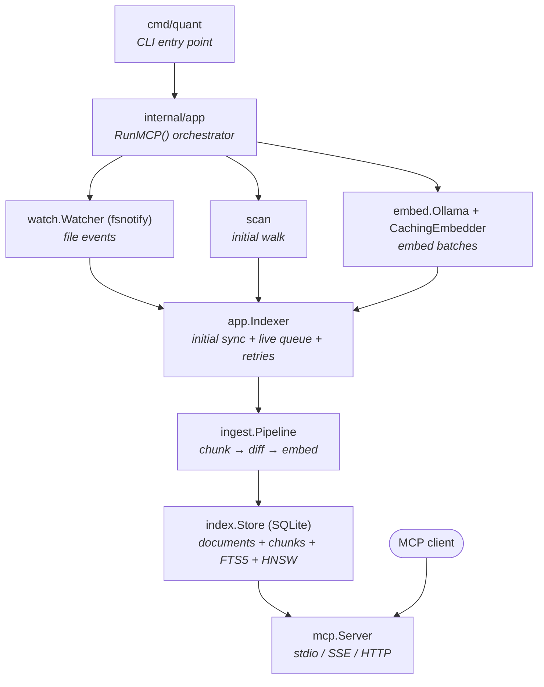

# Architecture

## Data flow

## Internal packages

| Package | Responsibility |
|---------|---------------|
| `cmd/quant` | CLI entry point. Parses commands (`mcp`, `update`, `version`, `help`) and delegates to `internal/app`. |
| `internal/app` | Top-level orchestrator. `RunMCP()` wires together the embedder, store, indexer, watcher, and MCP server. Contains the `Indexer` which manages initial sync, live indexing via a work queue, retry scheduling, and resync coordination. |
| `internal/config` | Configuration loading from flags, environment variables, and YAML files. Includes `PathMatcher` for include/exclude glob patterns. Validates all settings on startup. |
| `internal/watch` | Filesystem watcher built on `fsnotify`. Recursively watches directories, respects `.gitignore`, debounces events (500ms), and emits create/write/remove/resync events. Self-heals on overflow by triggering a full resync. |
| `internal/scan` | Filesystem walking, `.gitignore` loading, and file hashing. Used by the indexer for initial scans and resyncs. |
| `internal/extract` | Content extraction. A `Router` dispatches to the appropriate extractor based on file extension. Handles plain text, Jupyter notebooks, PDF (with optional OCR), Office/Open XML, OpenDocument, and RTF. |
| `internal/chunk` | Text splitting into chunks. Uses a strategy registry: code files get a code-aware chunker (function/class boundary detection), everything else uses a generic paragraph splitter with heading breadcrumbs and overlap. |
| `internal/ingest` | The indexing pipeline. Takes extracted text, chunks it, diffs against existing chunks to reuse embeddings, batches new chunks for embedding, and produces `ChunkRecord`s ready for storage. |
| `internal/embed` | Embedding backend. `Ollama` implements the `Embedder` interface with retry logic, input truncation, and dimension probing. `CachingEmbedder` wraps it with an LRU cache, in-flight request deduplication, and a circuit breaker for query-time calls. |
| `internal/index` | SQLite storage and search. Manages documents, chunks, FTS5 full-text index, embedding metadata, and the in-memory HNSW graph. Implements hybrid search combining FTS5 keyword results with vector similarity using RRF fusion. |
| `internal/mcp` | MCP server. Registers tools (`search`, `list_sources`, `index_status`, `find_similar`), handles tool calls with concurrency limiting, and serves over stdio, SSE, or streamable HTTP. Includes health/readiness endpoints for HTTP transports. |
| `internal/runtime` | Index state tracking (`starting` -> `indexing` -> `ready` / `degraded`). Thread-safe snapshot reads used by the MCP server for readiness checks. |
| `internal/selfupdate` | Binary self-update from GitHub Releases. Supports manual `quant update` and automatic background updates via `QUANT_AUTOUPDATE`. |
| `internal/logx` | Structured logging shim used throughout the codebase. |

## Key design decisions

**Int8 embedding quantization.** Embeddings are L2-normalized and quantized to 1 byte per dimension with per-vector min/max scaling before storage. This reduces storage by ~4x with less than 1% recall loss on normalized vectors.

**Incremental reindexing.** When a file changes, the ingest pipeline diffs the new chunks against existing ones by content hash. Only new or modified chunks are sent to the embedding backend. Unchanged chunks reuse their stored embeddings.

**HNSW lifecycle.** The HNSW graph is built in-memory after the initial filesystem scan completes. It is reconstructed from stored embeddings on restart after validating the recorded model metadata snapshot. During live indexing, nodes are added and removed incrementally.

**Transactional writes.** All chunk replacements for a single document happen inside one SQLite transaction. HNSW updates are deferred until after the transaction commits.

**Graceful degradation.** If the embedding backend becomes unavailable at query time, the circuit breaker opens and search falls back to keyword-only results. The embedding status is included in search responses so agents know when results are limited.

**Concurrency control.** MCP tool calls are bounded by a semaphore (`--max-concurrent-tools`, default 4) to prevent resource exhaustion when multiple agents query simultaneously.
