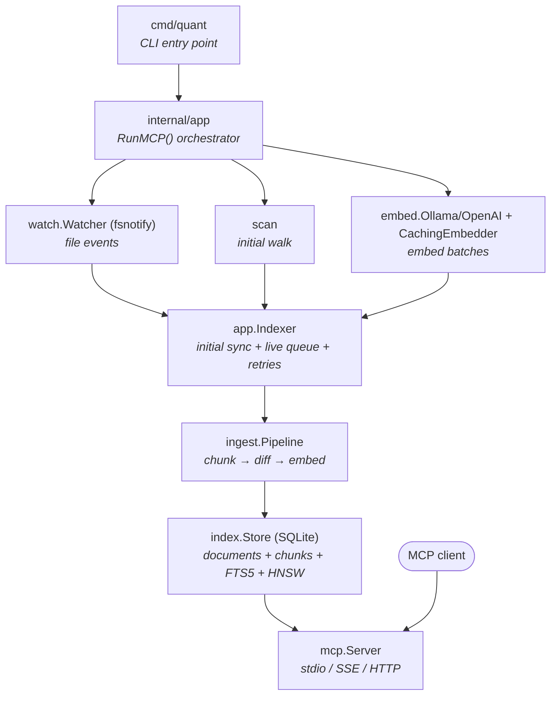

# Architecture

## Data flow

```mermaid
flowchart TD
    CLI["cmd/quant<br/><i>CLI entry point</i>"] --> APP["internal/app<br/><i>RunMCP() orchestrator</i>"]

    APP --> WATCH["watch.Watcher (fsnotify)<br/><i>file events</i>"]
    APP --> SCAN["scan<br/><i>initial walk</i>"]
    APP --> EMB["embed.Ollama/OpenAI + CachingEmbedder<br/><i>embed batches</i>"]

    WATCH --> IDX["app.Indexer<br/><i>initial sync + live queue + retries</i>"]
    SCAN --> IDX
    EMB --> IDX

    IDX --> PIPE["ingest.Pipeline<br/><i>chunk → diff → embed</i>"]
    PIPE --> STORE["index.Store (SQLite)<br/><i>documents + chunks + FTS5 + HNSW</i>"]
    STORE --> MCP["mcp.Server<br/><i>stdio / SSE / HTTP</i>"]

    CLIENT(["MCP client"]) --> MCP
```

## Internal packages

| Package | Responsibility |
|---------|---------------|
| `cmd/quant` | CLI entry point. Parses commands (`mcp`, `init`, `launch`, `update`, `version`, `help`) and delegates to the relevant subsystem. |
| `internal/app` | Top-level orchestrator. `RunMCP()` wires together the embedder, store, indexer, watcher, and MCP server. Contains the `Indexer` which manages initial sync, live indexing via a work queue, retry scheduling, and resync coordination. |
| `internal/config` | Configuration loading from flags, environment variables, and YAML files. Includes `PathMatcher` for include/exclude glob patterns. Validates all settings on startup. |
| `internal/watch` | Filesystem watcher built on `fsnotify`. Recursively watches directories, respects `.gitignore`, debounces events (500ms), and emits create/write/remove/resync events. Self-heals on overflow by triggering a full resync. |
| `internal/scan` | Filesystem walking, `.gitignore` loading, and file hashing. Used by the indexer for initial scans and resyncs. |
| `internal/extract` | Content extraction. A `Router` dispatches to the appropriate extractor based on file extension. Handles plain text, Jupyter notebooks, PDF (with optional OCR), Office/Open XML, OpenDocument, and RTF. |
| `internal/chunk` | Text splitting into chunks. Release builds use Go AST chunking for Go, heuristic declaration chunking for other code, and a generic paragraph splitter with heading breadcrumbs and overlap. Additional Tree-sitter implementations require the optional `treesitter` build tag. |
| `internal/ingest` | The indexing pipeline. Takes extracted text, chunks it, diffs against existing chunks to reuse embeddings, batches new chunks for embedding, and produces `ChunkRecord`s ready for storage. |
| `internal/embed` | Embedding backend. `Ollama` and `OpenAI` implement the `Embedder` interface with retry logic, input truncation, and dimension probing. Recognized local Ollama failures allow the app layer to attempt auto-recovery before falling back to keyword-only mode. `CachingEmbedder` adds an LRU cache, in-flight request deduplication, and a query-time circuit breaker. |
| `internal/llm` | Ollama and OpenAI-compatible chat completion used by optional cross-encoder reranking and chunk summarization. |
| `internal/index` | SQLite storage and search. Manages documents, chunks, FTS5, embedding metadata, document vectors, and HNSW persistence. Implements independent keyword and vector retrieval with RRF fusion. |
| `internal/mcp` | MCP server. Registers tools (`search`, `list_sources`, `index_status`, `find_similar`, `get_context`, `drill_down`, `summarize_matches`, `list_collections`, `delete_collection`), limits concurrent calls, and serves over stdio, SSE, or streamable HTTP. Includes health/readiness endpoints for HTTP transports. |
| `internal/lock` | Per-database process locking and metadata used to coordinate one main process with worker processes. |
| `internal/proxy` | Authenticated loopback RPC between the main process that owns the index and additional worker processes sharing the database. |
| `internal/runtime` | Index state tracking (`starting` -> `indexing` -> `ready` / `degraded`). Thread-safe snapshot reads used by the MCP server for readiness checks. |
| `internal/selfupdate` | Binary self-update from GitHub Releases with SHA-256 release-checksum verification. Supports manual `quant update` and automatic background updates via `QUANT_AUTOUPDATE`. |
| `internal/logx` | Structured logging shim used throughout the codebase. |
| `internal/errors` | Shared error classification helpers used by indexing and backend retry paths. |
| `internal/health` | Reusable health aggregation primitives. HTTP `/healthz` and `/readyz` currently perform their checks directly in the MCP server. |

## Key design decisions

**Int8 embedding quantization.** Embeddings are L2-normalized and quantized to 1 byte per dimension with per-vector min/max scaling before storage. This reduces storage by ~4x with less than 1% recall loss on normalized vectors.

**Incremental reindexing.** When a file changes, the ingest pipeline diffs the new chunks against existing ones by content hash. Only new or modified chunks are sent to the embedding backend. Unchanged chunks reuse their stored embeddings.

**HNSW lifecycle.** The HNSW graph is persisted beside the database as `<db>.hnsw` and accepted only when its model, dimensions, node count, and chunk generation match SQLite. Otherwise it is rebuilt from stored embeddings. During live indexing, nodes are added and removed after database commits; the graph is flushed every two minutes and at shutdown.

**Transactional writes.** All chunk replacements for a single document happen inside one SQLite transaction. HNSW updates are deferred until after the transaction commits.

**Graceful degradation.** For recognized local Ollama availability and model errors, `quant` attempts to start Ollama or pull the configured model. If those recovery steps fail, it starts in keyword-only mode. Other provider, authentication, URL, and protocol errors can remain fatal. At query time, the circuit breaker (5 consecutive failures, 30-second reset) provides a second fallback layer. Search responses include the effective embedding mode.

**Concurrency control.** MCP tool calls are bounded by a semaphore (`--max-concurrent-tools`, auto-tuned by CPU by default) to prevent resource exhaustion when multiple agents query simultaneously.

**Multi-process coordination.** Processes sharing a database use a database-scoped lock. One main process owns indexing and storage; compatible workers route operations through an authenticated loopback proxy. Index-affecting configuration mismatches are rejected.
